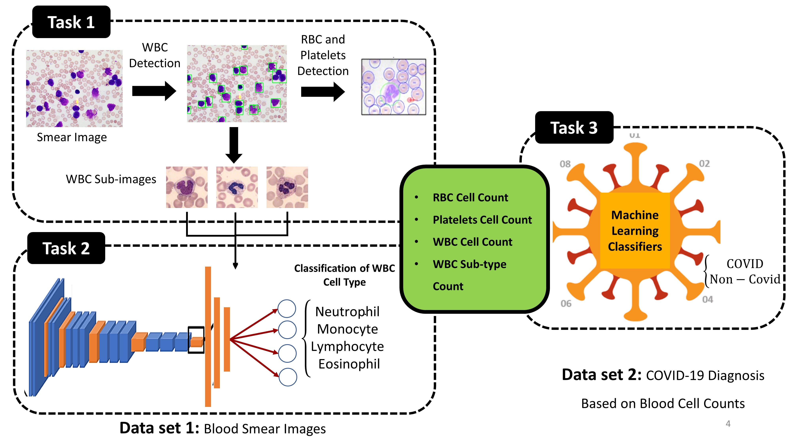
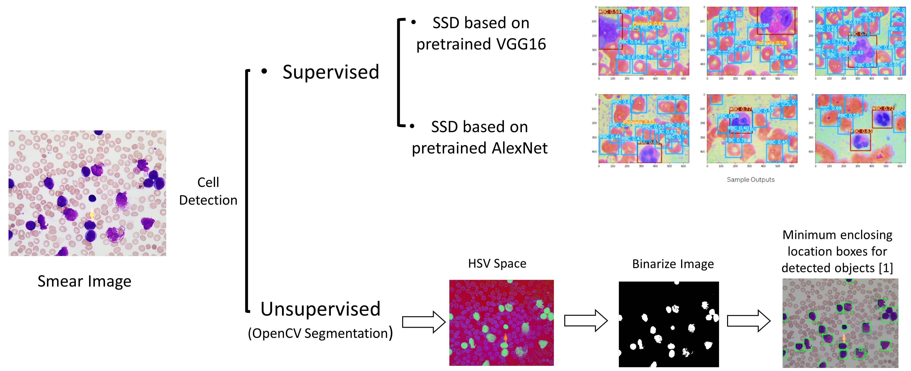
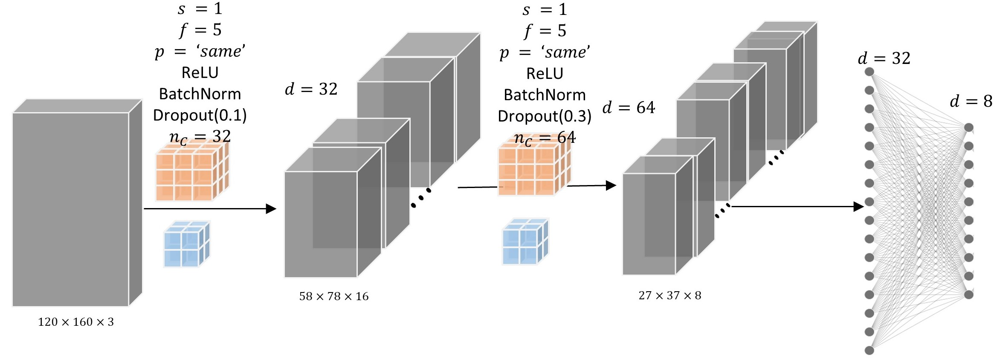
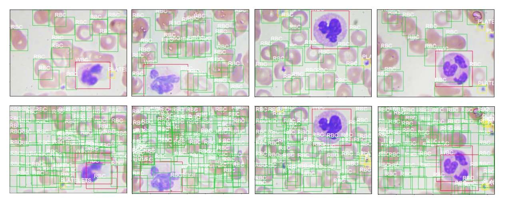

# Automated Blood Cell count from Blood Smear Images for COVID-19 Diagnosis
This repository contains the code and data for the paper "Automated Blood Cell count from Blood Smear Images for COVID-19 Diagnosis". The goal of this project is to provide a technique that can improve rapid and accurate decisions on COVID-19 diagnosis, treatment, and isolation needs.

## 1 Problem Statement & Aims

The current gold standard test for COVID-19 diagnosis is amplification of viral RNA by (real-time) reverse transcription polymerase chain reaction (rRT-PCR). However, it presents known shortcomings such as long turnaround times, potential shortage of reagents, false-negative rates, the need for certified laboratories, expensive equipment and trained personnel. Thus there is a need for alternative, faster, less expensive and more accessible tests. A recent work has shown that a simple blood test might help to reduce the false-negative rRT-PCR tests. Blood tests can be used in developing countries and in those countries suffering from a shortage of rRT-PCR reagents and/or specialized laboratories as an inexpensive and available alternative to identify potential COVID-19 patients. However, performing regular blood tests also requires medical experts. To leverage the advantage of blood analysis and reduce the cost of performing blood tests, researchers are recently working on automated blood-based COVID-19 diagnosis tests.

<figure>

<figcaption align = "center"><b>Fig.1 - Graphical Representation of pipeline of this project</b></figcaption>
</figure>

## 2 DATASET

In this project, two datasets have been exploited. The first dataset is the combined version of two datasets: https://github.com/Shenggan/BCCD_Dataset and https://www.kaggle.com/paultimothymooney/blood-cells, which contain a total of 17,092 annotated and labeled images of blood cells. In this dataset, each blood cell object (WBC, RBC, and Platelets) are annotated with a rectangular ground truth box and corresponding labels. Moreover, in this dataset, the cropped pictures of each WBC object are also labeled as following four groups: Neutrophil, Monocyte, Lymphocyte, Eosinophil. The size of the images is 540×960 pixels, in the format of jpg.

The second dataset, http://zenodo.org/record/3886927#.YFqiLkhKjVp, is consisted of routine blood-test results performed on 1,925 patients on admission to the ED at the San Raffaele Hospital (OSR) from February 19, 2020, to May 31, 2020. For each sample, COVID-19 diagnosis was determined based on the result of the molecular test for SARS-CoV-2 performed by RT-PCR on nasopharyngeal swabs. The response of each COVID-19 test data sample takes a binary value {0, 1} in case the COVID-19 test result is {negative, positive}, respectively. Table 1 in the paper represents the available features in this dataset.

| Table 1. Feature Descriptions | |
| ----------------------------- | --------------------- |
| Feature                       | Type                  |
| -------                       | -----                 |
| Gender                        | Categorical           |
| Age                           | Categorical           |
| Leukocytes (WBC)              | Numerical(continuous) |
| Red Blood Cells (RBC)         | Numerical(continuous) |
| Platelets                     | Numerical(continuous) |
| Neutrophils                   | Numerical(continuous) |
| Lymphocytes                   | Numerical(continuous) |
| Monocytes                     | Numerical(continuous) |
| Eosinophils                   | Numerical(continuous) |
| Basophils                     | Numerical(continuous) |

## 3 DATA PRE-PROCESSING

The input images for the cell detection model (SSD300) have to be transformed into float tensors with size 3x300x300 and normalized to ImageNet images.

## 4 Modules
This project has three main modules:

### 4.1 Module 1: Detection of blood cell objects (WBC, RBC, Platelets) in the collected smear image.

<figure>

<figcaption align = "center"><b>Fig.2 - Graphical Representation of models utilized in module 1</b></figcaption>
</figure>

### 4.2 Module 2: Classification of WBC sub-types based on the cropped subimages from the detected box for each WBC.

The main objective of this module is to classify the cropped smear images of detected WBC into four sub-types (Neutrophil, Monocyte, Lymphocyte, Eosinophil). To do so, we utilize eight CNN models:

(1) customized architecture 1 (Figure 3);
(2) customized architecture 2 (Figure 4);
(3) pre-trained ResNet50;
(4) pre-trained DenseNet121;
(5) pre-trained VGG16;
(6) pretrained MobileNet-v2;
(7) pre-trained Xception; and
(8) pre-trained Inception.

<figure>

<figcaption align = "center"><b>Fig.3 - Graphical Representation of customized architecture 1</b></figcaption>
</figure>

<figure>

<figcaption align = "center"><b>Fig.4 - Graphical Representation of customized architecture 2</b></figcaption>
</figure>

### 4.3 Module 3: COVID-19 Diagnosis based on the features collected from task 1 and task 2.
The main objective of this module is to classify COVID-19 diagnosis based on the collected features from module 1 and module 2. The model training of this module is based on the second data set in which the sample size is too small (201 samples). Therefore, we decided to perform this classification task by the classical machine learning classification models instead of deep learning models. To do so, we are using nine classifiers as follows:

(1) Logistic Regression;
(2) K-Nearest Neighbor;
(3) Linear SVM;
(4) Non-Linear SVM;
(5) Gaussian Process;
(6) Decision Tree;
(7) Random Forest;
(8) Multi-Layer Perceptron (MLP) with three layers containing (20,40,20)
neurons, respectively;
(9) AdaBoost.

## 5 Blood Cell Detection Output

<figure>

<figcaption align = "center"><b>Fig.5 - Detection examples on BCCD test dataset with VGG16(top) and Alexnet(bottom) based SSD models.</b></figcaption>
</figure>

## 6 White Blood Cell identification

Figure 6 and 7 illustrate the layer-1 feature maps generated from DenseNet121 and architecture 2,respectively, for three randomly selected samples.

<figure>

<figcaption align = "center"><b>Fig.6 - Layer-1 feature maps generated by pretrained DenseNet121.</b></figcaption>
</figure>

<figure>

<figcaption align = "center"><b>Fig.7 - Layer-1 feature maps generated by customized architecture 2.</b></figcaption>
</figure>

## 7 Usage
The code in this repository is written in Python and uses PyTorch and other libraries. 

## 8 References
Please refer to the paper folder for more details. 
